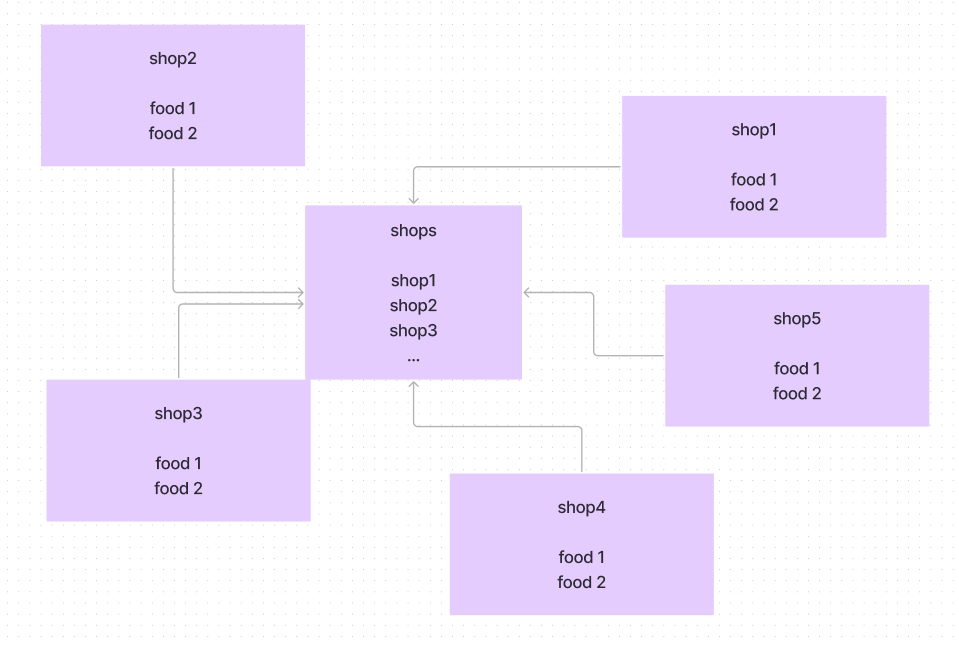

# 백엔드 1차 과제

여러분은 우아한 형제들의 백엔드 개발자에요.<br>
음식 주문 관리 REST API을 제작해야해요. <br>
중요한 부분을 모두 정리해놨으니 꼭 모두 읽은 다음 작업을 진행해주세요.

여러분이 구현해야하는 부분은 크게 두가지에요.

## 구현사항
### 사장님
1. 식당을 등록할 수 있어야 해요.
2. 식당 정보를 수정할 수 있어야 해요.
3. 식당을 삭제할 수 있어야 해요.
#### 식당을 만들면 식당안에서
   1. 음식을 등록할 수 있어야 해요.
   2. 음식을 수정할 수 있어야 해요.
   3. 음식을 삭제할 수 있어야 해요.
### 사용자
1. 식당리스트를 볼 수 있어야 해요.
2. 식당에 등록되어있는 음식을 볼 수 있어야 해요.
3. 음식을 추천하여 음식의 좋아요를 늘릴 수 있어야되요.
   - 이때 눌린 좋아요는 누가 눌렀는지 알 필요는 없어요.
4. 음식의 좋아요를 취소할 수 있어야 해요.

## Endpoint 및 파라미터 설정법
Endpoint는 크게 두가지가 될거에요.
### shop
shop 엔드포인트 안에서는 식당에 관련된 기능을 만들어야해요.
1. 식당 등록
2. 식당 목록
3. 식당 삭제
4. 식당 안에 있는 음식 목록
5. 음식 등록
6. 음식 수정
7. 음식 삭제
### food
food 엔드포인트 안에서는 이런 음식에 관련된 기능을 만들어야해요.
1. 음식 추천
2. 음식 추천 취소

## 가져야하는 body 구조
```json
{
  "shop" : {
    "uuid" : "string", // uuid
    "name" : "string", // 식당이름
    "ownerName" : "string", // 사장이름 (이번 구현에서는 직접 인력받아야해요)
    "category" : "string" // 한식, 양식, 중식, 일식, 분식 등
  }
}
```

```json
{
  "food" : {
    "uuid" : "string", // uuid
    "name" : "string", // 음식이름
    "price" : int, // 음식가겨
    "like" : int // 좋아요 수
  }
}
```

## 파일 구성
1폴더안에 자신의 이름으로 된 폴더를 만들어 작업을 합니다. <br> <br>
커밋은 기능 단위로 하고, 푸시는 그날 작업이 끝나면 합니다. <br> <br>
작업이 끝나면 PR을 올리고 코드리뷰를 받습니다.

## DataBase
### 데이터베이스 사용법
데이터베이스는 postgresql을 사용할 것 이에요. 그렇기에 ORM을 사용해야해요.<br/> <br>
Node 환경(express, Nest JS 등)에서는 TypeORM 혹은 Prisma를 사용해요. <br> <br>
Java 환경(Java & Kotlin Spring)에서는 JPA를 사용해요. <br> <br>
설치없이 바로 사용할 수 있도록 도커환경을 사용할꺼에요. docker-compose.yaml파일을 건들지 말고, 밑에 있는 명령어만 실행시키면, DB가 실행되요.<br/>
> 도커가 설치 되어있지 않다면 아래 아티클을 보고 도커를 설치해요
> https://mz-moonzoo.tistory.com/40

```shell
docker-compose up
```
하나의 터미널에서 실행시킨 후 새로운 터미널을 열어서 작업해요.
```
USER: postgres
PASSWORD: postgres
DATABASE: baemin
```
postgresql://localhost:5432/baemin

### Tips
shop 을 모아두는 테이블을 하나 두고, 각각의 food를 저장할 각 shop의 테이블을 만들어야 해요.
이런식의 테이블 구조를 가질꺼에요.


## API 명세서
Postman 혹은 Swegger를 사용해서 작업한 API를 정리해서 PR에 첨부해야해요.


## ✉️ 커밋 메세지
```
################
# <타입> : <제목> 의 형식으로 제목을 아래 공백줄에 작성
# 제목은 50자 이내 / 변경사항이 "무엇"인지 명확히 작성 / 끝에 마침표 금지
# 예) feat : 로그인 기능 추가
################
# feat : 새로운 기능 추가
# fix : 버그 수정
# docs : 문서 수정
# test : 테스트 코드 추가
# refact : 코드 리팩토링
# style : 코드 의미에 영향을 주지 않는 변경사항
# chore : 빌드 부분 혹은 패키지 매니저 수정사항
################
```

## ✉️ PR 템플릿
```
## 🔘Part

- [x] FE

  <br/>

## 🔎 작업 내용

- 기능에서 어떤 부분이

- 구현되었는지 설명해주세요

  <br/>

## 이미지 첨부


<br/>

## 🔧 앞으로의 과제

- 고치고 싶은 부분을 적어요.

  <br/>

## ➕ API 명세서

- 명세서 링크

<br/>
```